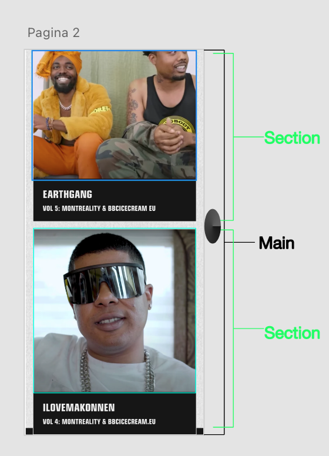
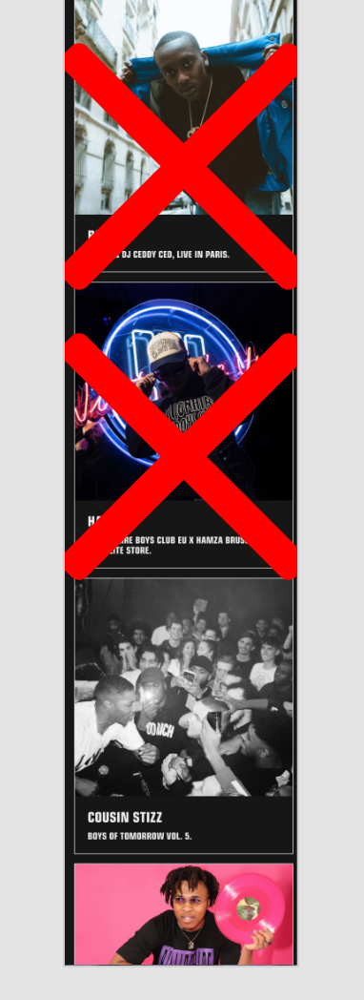
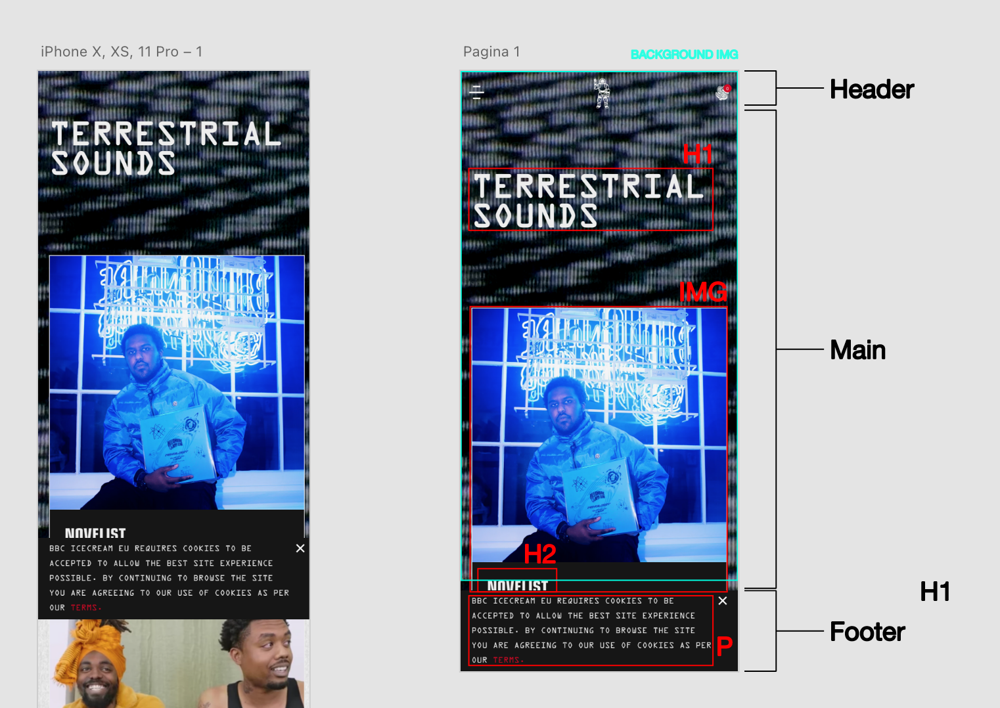
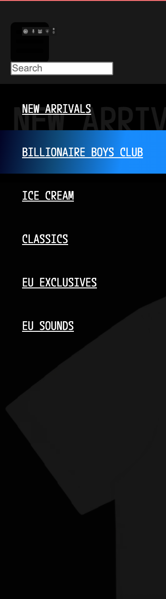
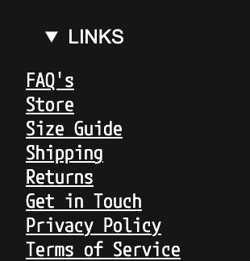
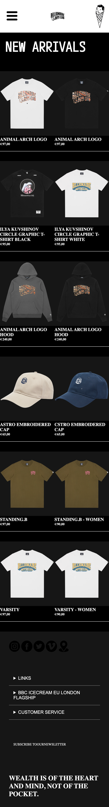

# Procesverslag
Markdown is een simpele manier om HTML te schrijven.  
Markdown cheat cheet: [Hulp bij het schrijven van Markdown](https://github.com/adam-p/markdown-here/wiki/Markdown-Cheatsheet).

Nb. De standaardstructuur en de spartaanse opmaak van de README.md zijn helemaal prima. Het gaat om de inhoud van je procesverslag. Besteedt de tijd voor pracht en praal aan je website.

Nb. Door *open* toe te voegen aan een *details* element kun je deze standaard open zetten. Fijn om dat steeds voor de relevante stuk(ken) te doen.

## Jij

uitwerken voor kick-off werkgroep

### Auteur:
Dayne Karganilla

#### Je startniveau:
Blauw

#### Je focus:
Surface plane
 

## Je website

uitwerken voor kick-off werkgroep

### Je opdracht:
https://bbcicecream.eu/pages/eu-sounds

#### Screenshot(s) van de eerste pagina (small screen): 
Op de eerste pagina die ik wil maken staan er kopjes met geinterviewde artiesten. Deze artiesten zijn geinterviewd door BBC.

#### Screenshot(s) van de tweede pagina (small screen):
Op de tweede pagina die ik wil maken kun je gaan shoopen, hierin zie je producten die de website verkoopt.

## Breakdownschets (week 1)

In de eerste week heb ik een breakdown gemaakt van de eerste EU sound pagina op Adobe XD

### De stukjes in de eerste pagina die weg kunnen: 

### Een breakdown van een pagina: 

## Voortgang 1 (week 2)

uitwerken voor 1e voortgang

### Stand van zaken
In de eerst had ik moeite met de achtergrond, h1, en het verdelen van mijn breakdowns. De h1 niet goed werd gepositioneerd, de achtergrond was wazig en de breakdowns kon ik niet zo goed begrijpen. Dit had ik vervolgens opgelost en is het goed gekomen. Ik hab nog niet de juiste achtergrond gebruikt, dit probleem los ik later op.

### Verslag van meeting
De eerste meeting was positief, alleen was mijn html niet netjes. Dit heb ik vervolgens gecorrigeerd.

## Voortgang 2 (week 3)

uitwerken voor 2e voortgang

### Stand van zaken
Ik had moeite met het maken van mijn hamburger menu. Ik was van plan om zelf eentje te maken met CSS, maar daar had ik moeite mee, hierdoor was ik toch gegaan voor een PNG. Ik heb veel moeite ingestoken, omdat ik dit zelf wilde oplossen. Dit is vervolgens goed gekomen en was ik verder met het opzetten van de UL,LI,A, kleur etc.

### Verslag van meeting
De hamburger menu ziet er goed uit. Ik had veel onnodige dingen op css, die weg konden. Ze zaten bijvoorbeeld dubbel of werkte iet, dit heb ik vervolgens opgelost.

## Toegankelijkheidstest (week 4)

uitwerken na test in 8e voortgang

### Bevindingen
Lijst met je bevindingen die in de test naar voren kwamen:

#### Eerste bevinding
Je kan hover, a, focus, active leren gebruiken.

#### Tweede bevinding. 
Ik kreeg errors in mijn html, veel fouten zijn dat de A niet binnen de UL mag zitten, dat komt doordat alleen een 'LI' direct binnen een UL mag zitten. dus in plaats van ul,a ,li, moest het ul, li, a zijn. Dit heb ik vervolgens gecorrigeerd.

## Voortgang 3 (week 4)

uitwerken voor 3e voortgang

### Stand van zaken
Ik had aan mijn tweede pagina gewerkt. De pagina met producten dit te koop zijn. Ook heb ik aan de footer gewerkt dit heb ik vervolgens gemaakt in mijn tweede pagina. Vervolgens geplakt in de eerste pagina van mijn html. Verder heb ik gewerkt aan de opzet van de tweede pagina van de producten.

### Verslag van meeting
Derde voortgang was ik afwezig, omdat ik mij niet goed voelde.

## Eindgesprek (week 5)

uitwerken voor eindgesprek

### Stand van zaken
Ik moest nog paar dingen verbeteren:
* States.
* List icons niet weggehaald, zijn ook geen linkjes in footer.
* Paar contrast issues.
* Linkjes in menu doen nog niet helemaal wat ze moeten doen.
* Zitten nog wat errors in de valdiator.
* CSS variabelen zijn er niet.
* Procesverslag nog niet af.

### Screenshot(s)

## Bronnenlijst

continu bijhouden terwijl je werkt

Nb. Wees specifiek ('css-tricks' als bron is bijv. niet specifiek genoeg).

1. https://css-tricks.com/ (bij het maken van een menu)
2. https://fonts.google.com/ (fonts die ik gebruikt heb)
3. https://www.w3schools.com/tags/tag_ul.asp (ul,li, a volgorde voor mijn linkjes om geen error meer aan te geven. Ook bepaalde errors zoeken, px omrekenen naar em)
3. Studentenassistent - Sam

